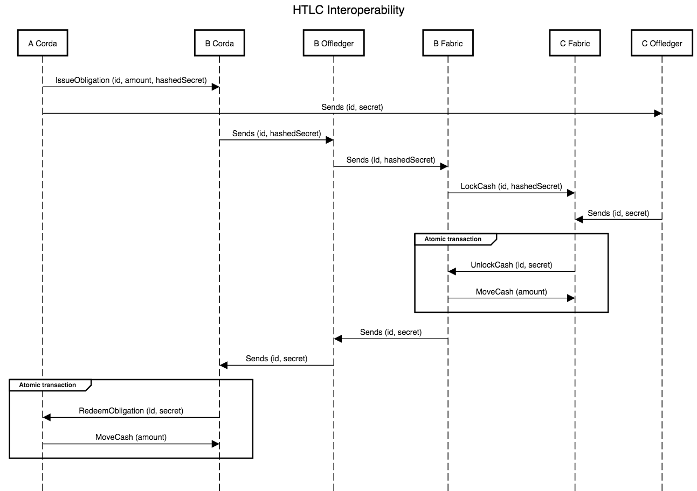

# Sequence Diagram

# Network
Hashed Timelock Contract (HTLC) allows the movement of asset from one DLT to another DLT. 
* Party A: Has a Corda Node
* Party B: Has a Corda Node and a non-corda node i.e. Fabric
* Party C: Has a non-corda DLT node i.e. Fabric

>Note: All off-ledger and non-corda operations are assumed as implemented. We will only deal with corda contracts and flows here.

# How it  works
1. Party A is trying to deposit an amount of cash to Party C in a non-corda network. Party A does not own any node in the non-corda network but Party B has nodes on both network.
2. Party A (borrower/locker) will issue an obligation with a hashed secret and release time to Party B (lender/lockee) promising to pay the amount if and only if Party B can provide the secret when current time is less than release time 
3. Party A will also send the secret to Party C's off-ledger.
4. Party B will send the ID and hashed secret taken from the obligation and sends it to its own off-ledger.
5. Party B off-ledger will forward the ID and hashed secret to Party B's non-corda node. 
6. **Non-Corda** Party B node will lock some cash with the ID and hashed secret. 
7. **Non-Corda** Party C will propose to unlock and redeem the cash with the ID and secret taken from the off-ledger.
8. **Non-Corda** Party B will receive the secret in exchange for the cash he transferred to Party C in the non-corda network.
9. **Non-Corda** Party B will send the secret to its off-ledger where it will be forwarded to its own **Corda** Party B node.
10. Party B will propose to redeem the obligation by providing the ID and secret in exchange for Party A's cash.
11. The obligation will be settled and cash will be transferred from Party A to Party B's balance.

# TODO
1. If borrower has 0 cash when lender is trying to redeem with the correct secret, the obligation will then be *DEFAULTED* which the borrower must settle in the future.
2. If borrower has some cash to settle partially when lender tries to redeem the obligation, then the state will have a positive paid amount (larger than 0).
3. The borrower/locker can cancel an obligation if and only if 
    1. The obligation is not *DEFAULTED*
    2. The obligation paid amount is *equal* to 0.
    3. Current time is *larger* than release time.
4. Lender/lockee is allowed cancel an obligation at any time if he deems it unnecessary to receive said amount from the obligation.
5. Borrower/locker can also optionally settle obligation ahead of time i.e due to real world agreements / arrangement with the counter-party.
6. Add flexibility to choose hashing algorithm.
7. Add API to redeem obligation. Right now there's only flow unit tests.

## Issue an obligation

1. Click on the "create IOU" button.
2. Select the counter-party, enter in the currency (GBP) and the amount, 1000
3. Click create IOU with a plain text secret.
4. Wait for the transaction confirmation
5. Click anywhere
6. Press the refresh button
7. The UI should update to reflect the new obligation.
8. Navigate to the counter-parties dashboard. You should see the same obligation there. The party names show up as random public keys as they are issued confidentially. Currently the web API doesn't resolve the party names.

## Redeem an obligation
1. Provide the linear id and secret to the obligation.
2. The contract will hash the secret and compare it against the hashed secret already specified in the obligation.
3. Wait for the transaction confirmation.
4. Cash should be transferred to the lender's balance if the secret provided is hashed to the same hashed secret in the obligation.
   
## Self issue some cash

From the obligation borrowers UI:

1. Click the issue cash button
2. Enter a currency (GBP) and amount, 10000
3. Click "issue cash"
4. Wait for the transaction confirmation
5. click anywhere
6. Click the refresh button
7. You'll see the "Cash balances" section update

## Settling an obligation

In order to complete this step the borrower node should have some cash. See the previous step how to issue cash on the borrower's node.

From the obligation borrowers UI:

1. Click the "Settle" button for the obligation you previously just issued.
2. Enter in a currency (GBP) and amount, 500
3. Press the "settle" button
4. Wait for the confirmation
5. Click anywhere
6. Press the refresh button
7. You'll see that £500 of the obligation has been paid down
8. Navigate to the lenders UI, click refresh, you'll see that £500 has been paid down

This is a partial settlement. you can fully settle by sending another £500. The settlement happens via atomic DvP. The obligation is updated at the same time the cash is transfered from the borrower to the lender. Either both the obligation is updated and the cash is transferred or neither happen.

That's it!

From the lenders UI you can transfer an obligation to a new lender. The procedure is straight-forward. Just select the Party which is to be the new lender. Refresh teh UIs to see the reflected changes.

Feel free to submit a PR.
